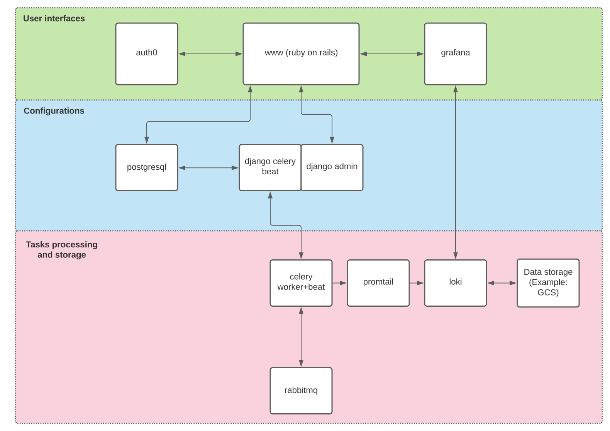

# 

CronRobot is an open source cron-based scheduler system. Define your monitoring and recurring tasks in one simple system. Get notified when things go wrong. Easy.

CronRobot consists of the following pieces:

- A front site with administration dashboard ([www-cronrobot](/www-cronrobot)): Allows to login, manage, and view cron schedulers.
- A job runner ([celery-admin](/celery-admin)): Based on the python celery system. Currently setup to use rabbitmq as the queuing system.
- [Grafana](https://grafana.com/): Display cron scheduler metrics.
- [promtail](https://grafana.com/docs/loki/latest/clients/promtail/): For reading (stream) logs. Forward logs to the loki instance.
- [loki](https://grafana.com/oss/loki/): Aggregate logs and streamed to an external storage system.

## Architecture

The main parts of the system are designed as follows:

## Documentation

The documentation is available at [http://docs.cronrobot.io/](http://docs.cronrobot.io/).